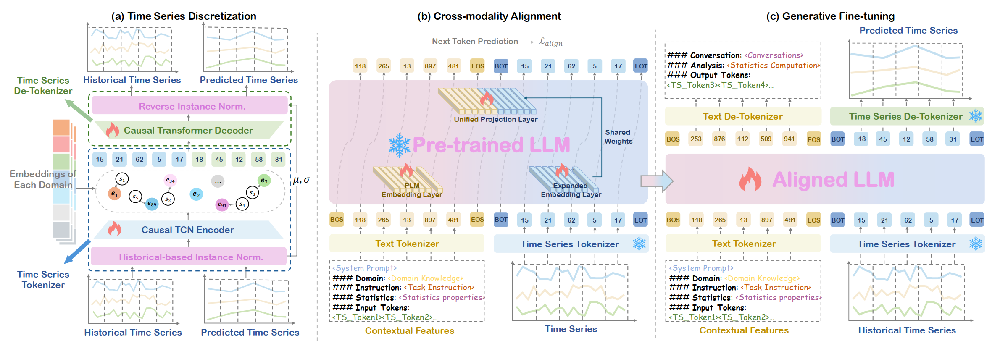

TokenCast
<div align="center">
  <h1>TokenCast: An LLM-Driven Framework for Context-Aware Time Series Forecasting via Symbolic Discretization</h1> 
</div>

---

TokenCast is a novel framework that leverages **Large Language Models (LLMs)** for **context-aware time series forecasting**, by transforming continuous time series into discrete symbolic tokens. It enables a unified generative modeling over both temporal and textual modalities.

> 📝 “From Values to Tokens: An LLM-Driven Framework for Context-aware Time Series Forecasting via Symbolic Discretization” 
---

## 🔍 Overview

Traditional forecasting models struggle to effectively integrate heterogeneous contextual data like clinical notes, policy documents, or logs. TokenCast introduces a new paradigm:

- Converts time series into **discrete temporal tokens** via dynamic vector quantization.
- Embeds both temporal and textual tokens into a **shared semantic space** using a frozen pre-trained LLM.
- Performs **prompt-based generative forecasting** using autoregressive language modeling.

<p align="center">
  
</p>

---

## ✨ Key Features

- ✅ **Discretized Temporal Modeling**: Learnable, reversible tokenizer for symbolic time series.
- 🔗 **Cross-Modality Alignment**: Unified vocabulary space for both time and text tokens.
- 📈 **Prompt-driven Generation**: Forecasting with LLM via token-level instruction generation.
- 📊 **Multi-domain Evaluation**: Benchmarked across economic, health, web, stock, and environmental domains.
- 🌡️ **Uncertainty Quantification**: Predictive intervals with temperature-controlled generation.

---
## 🚀 Getting Started

### 1. Clone the repo

```bash
cd TokenCast
```

### 2. Environment Setup

```bash
conda create -n tokencast python=3.10
conda activate tokencast
pip install -r requirements.txt
```

### 3. Prepare Data
TokenCast supports multiple publicly available datasets:
- **Economic (FRED-MD)**
- **Health (Covid-19 mobility)**
- **Web (Wikipedia pageviews)**
- **Stock-NY & Stock-NA (NYSE/NASDAQ)**
- **Nature (Environmental sensor data)**

First, the training and evaluation datasets used in our experiments can be found in [Google Drive]. Then, create a directory named `datasets` and download the necessary datasets into it.

```bash
mkdir datasets
```

### 4. Train the Time Series Tokenizer

```bash
sh Tokenizer/scripts/Czelan.sh 
```

### 5. Align Embeddings with LLM

```bash
sh scripts/pretrain/Czelan.sh  
```

### 6. Fine-tune Forecasting Model

```bash
sh scripts/finetune/Czelan.sh 
```

------

## 📊 Benchmark Results
**Full Results:**


**Ablation Results:**


